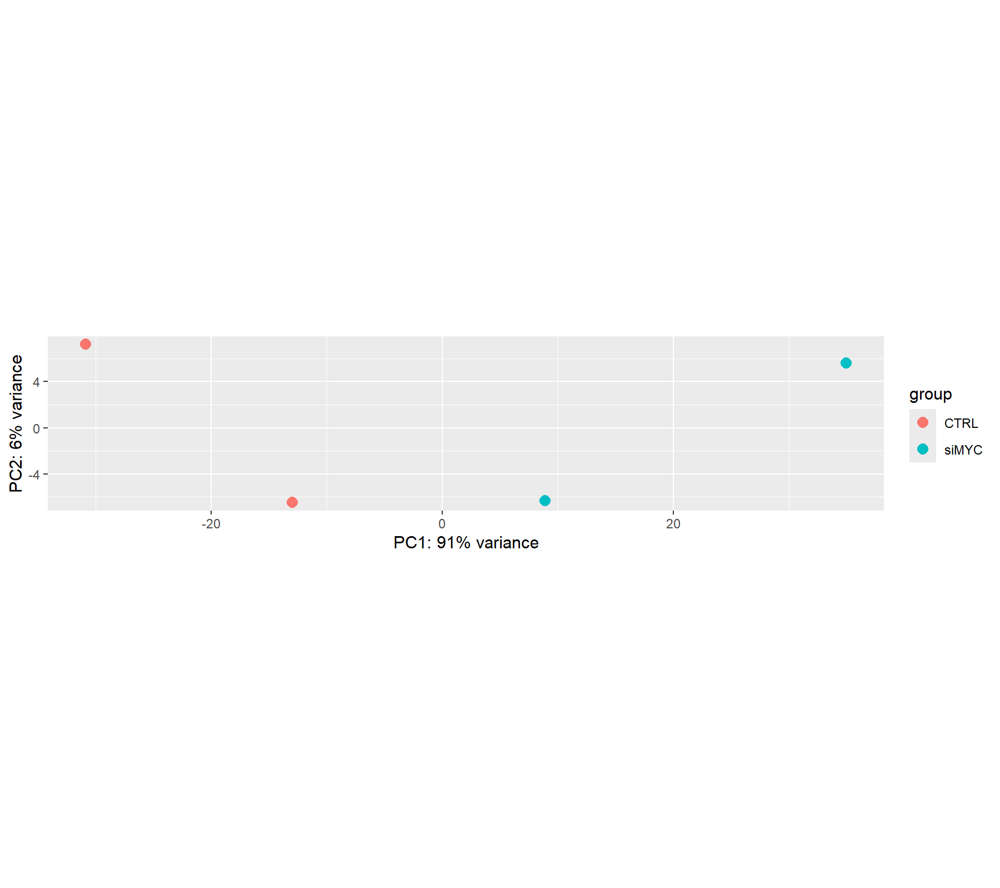
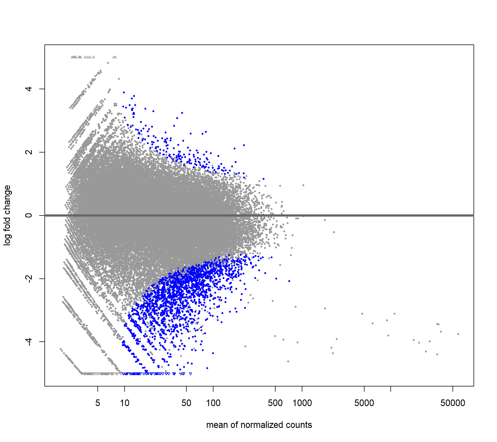
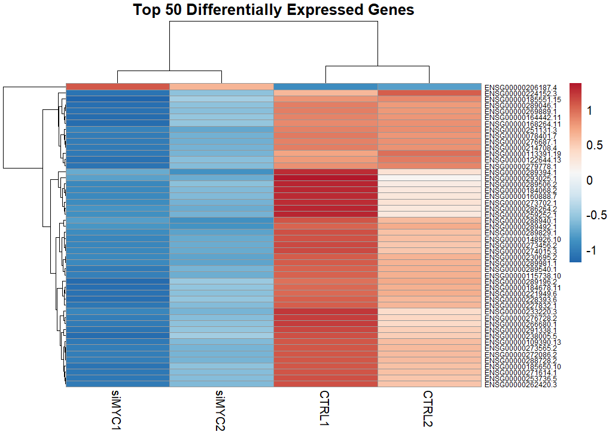

# A549 MYC Knockdown (siMYC) RNA-seq Analysis — Layer 2 of LUAD MYC Multi-Omics

This repository contains a complete RNA-seq workflow for A549 lung adenocarcinoma cells following MYC knockdown using siRNA (siMYC).
The objective is to characterize transcriptomic changes driven by loss of MYC, a major oncogenic transcription factor in LUAD.

Although this analysis is part of a larger multi-omics framework, this repository is fully self-contained and functions as a stand-alone RNA-seq project.
It represents Layer 2 of the LUAD MYC regulatory map:

- Layer 1: MYC ChIP-seq (DNA binding sites)

- Layer 2: RNA-seq (this repo — MYC-dependent gene expression)

- Layer 3: ATAC-seq (chromatin accessibility, coming next)

A separate combined repository will later hold cross-layer figures (Layer1+Layer2).

## 1. Introduction

MYC is a master regulator of cell growth, metabolism, ribosome biogenesis, and transcriptional amplification in cancer.
To understand how MYC controls gene expression in LUAD, the MYC gene was silenced using siRNA, generating:

- CTRL: A549 cells with normal MYC

- siMYC: A549 cells with reduced MYC expression

RNA-seq enables the identification of:

- Genes that require MYC for expression (downregulated in siMYC)

- Genes that MYC normally represses (upregulated in siMYC)

- Pathways impacted by MYC loss

This provides a quantitative map of MYC-dependent transcriptional programs.


## 2. Dataset Overview
| Sample | Condition | SRA Accession |
| ------ | --------- | ------------- |
| CTRL1  | Control   | SRR8309421    |
| CTRL2  | Control   | SRR8309422    |
| siMYC1 | Knockdown | SRR8309423    |
| siMYC2 | Knockdown | SRR8309424    |
All processing in this project uses raw FASTQ files downloaded from SRA.

## 3. Workflow Summary
Step-wise RNA-seq pipeline:

1. Download FASTQ files

2. FASTQC → read-level quality assessment

3. MultiQC → aggregated QC overview

4. HISAT2 alignment to GENCODE hg38

5. SAM/BAM sorting + indexing

6. Gene quantification using featureCounts

7. Differential expression with DESeq2

8. Functional enrichment (GO, KEGG, Reactome)

9. Biological interpretation of MYC-dependent transcriptional changes

This workflow mirrors standard RNA-seq pipelines used in large-scale cancer genomics studies.

## 4. Quality Control (FASTQC + MultiQC)

QC reports are stored in: qc/

Key QC observations

- High read quality across all cycles (Phred > 30)

- Minimal adapter content, no trimming required

- Duplication levels acceptable for mammalian RNA-seq

- Consistent GC content with human transcriptome expectations

- No sample contamination or library preparation issues

This confirms that sequencing quality is suitable for downstream analysis.

## 5. Alignment — HISAT2
Reference genome: GENCODE hg38 (primary assembly)
Index stored in: genome_index/

Results Summary

- All samples show high alignment rates

- HISAT2 splice-aware alignment handles exon junctions accurately

- Sorted/indexed BAM files stored in: aligned_bam/

This ensures accurate estimation of gene-level counts.

## 6. Gene Quantification — featureCounts

Gene quantification produces:

- gene_counts.txt

- matching summary file

Counts are stored in counts/ and serve as the basis for differential expression.

featureCounts was run using:

- GENCODE v45 GTF annotation

- Paired-end mode

- Strand-unaware (consistent with dataset metadata)

## 7. Differential Expression Analysis — DESeq2

All DESeq2 outputs are in DE_results/.

The DESeq2 model:

- Normalizes for sequencing depth

- Estimates gene-wise dispersion

- Computes log2 fold changes + adjusted p-values

- Compares siMYC vs CTRL

7.1 PCA Plot
```

```
Interpretation:
Samples cluster by condition, with PC1 explaining 91% of variance.
MYC knockdown is the dominant driver of transcriptional differences.

7.2 MA Plot
```

```
Interpretation:
Genes downregulated in siMYC (blue) represent transcripts dependent on MYC activity.
A broad downward shift reflects MYC’s global role in transcription and RNA metabolism.

7.3 Heatmap of Top 50 DEGs
```

```
Interpretation:
Samples group cleanly by condition.
siMYC samples show consistent up- or down-regulation patterns, indicating a robust biological effect.

## 8. Biological Interpretation of MYC Knockdown
8.1 Downregulated Genes (MYC-Activated)

MYC knockdown reduces transcripts involved in:

- Ribosome biogenesis

- RNA splicing and processing

- Nucleosome assembly

- DNA replication

- Cell cycle progression

- Translation machinery

These pathways are well-established MYC-dependent programs in LUAD.

Conclusion:
MYC is required to sustain high transcriptional, metabolic, and proliferative activity.

8.2 Upregulated Genes (MYC-Repressed)

A strong interferon-stimulated gene (ISG) signature emerges:

- ISG15

- IFIT1, IFIT2, IFIT3

- IFI44, IFI44L

- IRF1

- STAT1

- MX1

- OAS1/OAS2/OASL

- BST2

- CMPK2

Interpretation:
MYC normally suppresses antiviral response pathways.
Loss of MYC derepresses innate immune and inflammatory programs.

This is consistent with multiple MYC-loss models across cancer types.

## 9. Functional Enrichment Analysis

Enrichment files stored in: enrichment_all_DEGs/

GO Biological Process

Downregulated processes:

- mRNA processing

- RNA splicing

- Chromatin assembly

- rRNA metabolic process

- Cell cycle–related pathways

These reflect MYC’s central role in transcriptional amplification and cellular growth.

KEGG Pathways

- Ribosome ↓

- Cell cycle ↓

- DNA replication ↓

- p53 signaling ↑

- Viral infection pathways ↑

Reactome Pathways

- RNA polymerase I transcription ↓

- rRNA transcription ↓

- Stress-induced senescence ↑

- Interferon signaling ↑

Overall, MYC loss shifts the cell from a “growth-driven state” to a “stress/immune-activated state”.

## 10. Project Folder Structure
```
LAYER2_RNAseq/
│
├── raw_fastq/                 # Raw FASTQ files
├── qc/                        # FASTQC + MultiQC reports
├── genome_index/              # HISAT2 genome index
├── aligned_bam/               # Sorted & indexed BAM files
├── counts/                    # featureCounts output
├── DE_results/                # DESeq2 results and scripts
├── enrichment_all_DEGs/       # GO/KEGG/Reactome results
├── plots/                     # PCA, MA, heatmap, enrichment figures
├── scripts/                   # Bash and R scripts for reproducibility
└── logs/                      # Log files from alignment and quantification
```
11. Reproducibility

All processing scripts used in this project are in scripts/:

- FASTQ QC

- HISAT2 alignment

- SAM/BAM processing

- featureCounts

- DESeq2

- Enrichment analysis

The repository is fully reproducible end-to-end.

## 12. Summary

This RNA-seq analysis defines the transcriptional consequences of MYC knockdown in A549 LUAD cells.

Major conclusions

- MYC maintains high expression of genes involved in RNA processing, ribosome biogenesis, and cell cycle control.

- MYC represses antiviral/interferon pathways, which become strongly activated when MYC is silenced.

- The results provide a transcriptional layer (Layer 2) of the LUAD MYC regulatory map.

This repository will integrate with ChIP-seq (Layer 1) in a separate multi-layer visualization repository.
